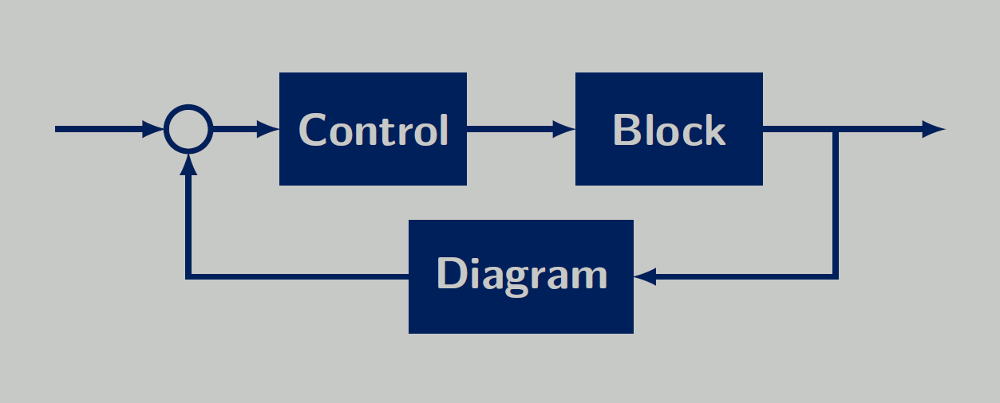

# Control Block Diagram


[**Overview**](#overview)
| [**Quickstart**](#getting-started)
| [**Examples**](#examples)
| [**Installation**](#installation)

## Overview
The control-block-diagram package is a Python Toolbox for drawing block diagrams. It is build
upon [Pylatex](https://jeltef.github.io/PyLaTeX/current/), and therefore, can generate Latex
files and also PDF files. It allows you to construct typical control block diagrams with the
usual building blocks, i.e., PI-Controllers, Adders, Multiplier. It is also possible to
define own blocks. 

## Getting Started

The easiest way to get started with the ControlBlockDiagram Toolbox is to play around with the Hands On Jupyter Notebook. There the most important functions are explained and demonstrated with simple examples.

[Hands On Jupyter Notebook](https://github.com/upb-lea/control-block-diagram/blob/main/examples/Control_Block_Diagram_Hands_On.ipynb)

A basic routine is as simple as:
```py
from control_block_diagram import ControllerDiagram
from control_block_diagram import Point, Box, Connection


if __name__ == '__main__':
    doc = ControllerDiagram()
    
    box_control = Box(Point(0, 0), text='Control')
    box_block = Box(box_control.position.add_x(3), text='Block')
    box_diagram = Box(box_block.position.add_x(3), text='Diagram')

    Connection.connect(box_control.output, box_block.input)
    Connection.connect(box_block.output, box_diagram.input)
    
    doc.save('pdf')
    doc.show()
```

The output of this code is:


## Examples
There are some examples in the examples folder:

* [Flux Observer](https://github.com/upb-lea/control-block-diagram/blob/main/examples/flux_observer.py)
* [FPGA Board](https://github.com/upb-lea/control-block-diagram/blob/main/examples/fpga_example.py)
* [Induction Motor Controller](https://github.com/upb-lea/control-block-diagram/blob/main/examples/induction_motor_controller.py)
* [Model Predictive Controller](https://github.com/upb-lea/control-block-diagram/blob/main/examples/model_predictive_controller.py)

## Installation


- Install from GitHub source:

```
git clone git@github.com:upb-lea/control-block-diagram.git 
cd control-block-diagram
# Then either
python setup.py install
# or alternatively
pip install -e .

# or alternatively
pip install git+https://github.com/upb-lea/control-block-diagram
```

You also need a latex compiler such as pdfLaTex to create a PDF file.  For example, you can get this from the latex distribution [MiKTeX](https://miktex.org/).


